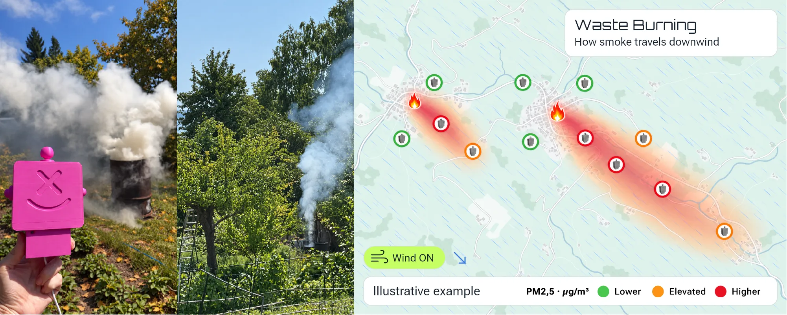
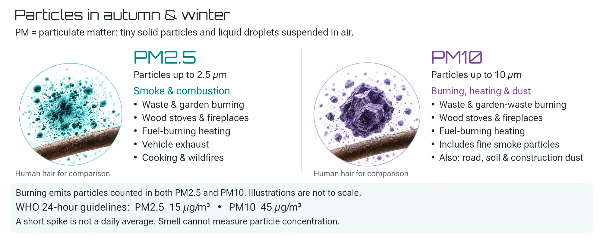
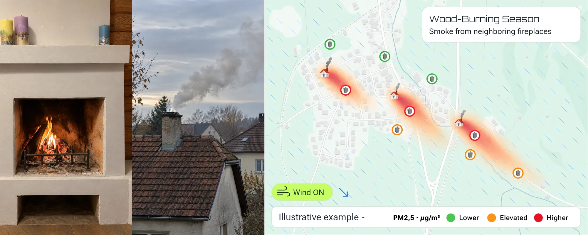
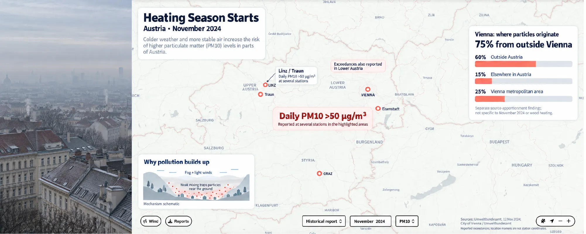
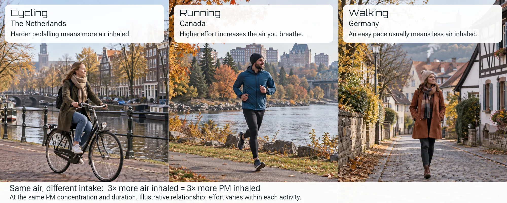
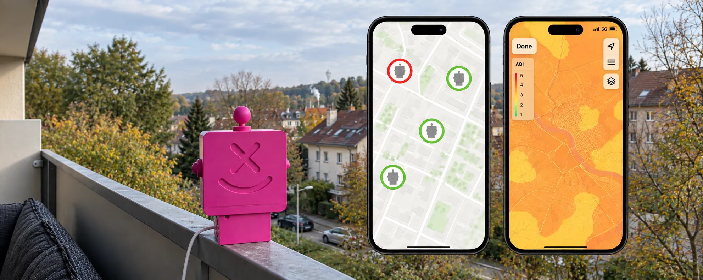

## Smoke Around Your Home in Autumn and Winter: Garden Fires, Fireplaces and Heating Season

Autumn changes the air around our homes more than it may seem. First, there is the occasional smell of burning leaves and branches. Then the evenings get colder, and fireplaces and wood-burning stoves are used more frequently. A few weeks later, the full heating season begins — often together with calm weather and temperature inversions that can keep pollution close to the ground for several hours or even days. We notice smoke easily with our noses, but smell tells us surprisingly little about what is actually happening in the air. Visible smoke may disappear while microscopic particles remain, and a strong smell alone does not tell us how high their concentration is. This is why the air quality reported for an entire city and the air directly outside one particular home can tell very different stories.

## 1. Autumn Smoke Around Your Home: What Remains in the Air After a Garden Fire

Autumn brings more local sources of smoke: garden fires, burning leaves and branches, and outdoor fire pits. Smoke can travel with the wind far beyond the property where the fire is burning.

**Even a small source of smoke can temporarily and noticeably change the air quality around your home.**

Burning garden waste may seem harmless because it is natural material, but wet leaves and freshly cut branches burn poorly. They are more likely to smolder at relatively low temperatures and with insufficient oxygen, producing much more smoke. Germany’s Umweltbundesamt recommends avoiding the open burning of garden waste and notes that particulate pollution from such fires can affect the air **several kilometers away from the source**. This means that the fire you smell outside your home may not be burning at your nearest neighbor’s property at all: wind, terrain and surrounding buildings can carry smoke between streets and neighborhoods, while calm weather can allow it to linger much longer. ([Umweltbundesamt](https://www.umweltbundesamt.de/themen/wohin-dem-laub))

### What Are PM2.5 and PM10, in Simple Terms?

PM stands for _Particulate Matter_ — microscopic solid particles and droplets suspended in the air. They can include dust, soot, smoke, salts, metals and many other substances. **PM10** refers to particles up to 10 micrometers in diameter, while **PM2.5** refers to even smaller particles up to 2.5 micrometers. In everyday terms, the easiest way to imagine them is as almost invisible fine dust floating around us, except that the sources of this “dust” can include not only ordinary dust, but also fireplaces, garden fires, traffic and heating systems. The smaller the particles are, the deeper they can penetrate into the respiratory system, which is why PM2.5 receives particular attention when discussing air pollution and health. ([RIVM](https://www.rivm.nl/houtrook/stoffen-en-concentraties-houtstook))

For context, the World Health Organization recommends a 24-hour average concentration of **15 µg/m³ for PM2.5** and **45 µg/m³ for PM10**. These are 24-hour averages, so a short spike on a sensor graph cannot automatically be considered an exceedance of the WHO daily guideline. Nevertheless, short peaks can be very useful because they show that something has changed in the local environment. ([WHO](https://www.who.int/teams/environment-climate-change-and-health/air-quality-and-health/health-impacts/types-of-pollutants))

This creates one of the main paradoxes of smoke: **your nose can detect a fire, but it cannot measure the amount of particulate matter**. Two evenings may smell equally smoky while showing completely different PM2.5 and PM10 levels.

## 2. Wood-Burning Season: The Fireplace Next Door

As temperatures fall, fireplaces and wood-burning stoves are used more frequently. What creates warmth and comfort inside one home becomes smoke outside, and air currents can carry it toward neighboring homes.

**The fireplace may belong to your neighbor, but the air around it is shared.**

Wood combustion produces fine particles of smoke and soot, including PM2.5, which can remain in the air even after the visible smoke has disappeared. An ordinary PM sensor cannot determine that one particular fireplace caused one particular spike: the same reading may be influenced at the same time by traffic, other stoves, regional background pollution and weather. What continuous local monitoring can reveal, however, is a **recurring pattern**. PM2.5 and PM10 may begin rising at roughly the same time every evening, peaks may become stronger when the wind comes from a certain direction and disappear when the wind changes. This provides a completely different level of understanding compared with simply noticing that “it smells smoky again.”

### Germany: Millions of Household Fireplaces and Stoves Become Part of the Winter Air

In Germany, wood heating is far from a rare exception. According to Umweltbundesamt, in 2023 the country had around **11.7 million individual room-heating appliances** — including fireplaces, fireplace stoves, tiled stoves, open fireplaces and pellet stoves. Many of them are used as supplementary rather than primary heating, which means they are particularly likely to be used on cool evenings. ([Umweltbundesamt](https://www.umweltbundesamt.de/system/files/medien/11850/publikationen/2026-05/62_2026_TEXTE.pdf))

Their combined contribution is clearly visible in the winter air-quality picture. Measurements using specific chemical tracers show that particles from wood burning typically account for around **10–20% of winter particulate pollution in Germany** — and similar values are observed in both urban and rural areas. To reliably distinguish wood smoke from other sources, researchers use specific markers such as levoglucosan. ([Umweltbundesamt](https://www.umweltbundesamt.de/themen/luft/luftschadstoffe/feinstaub/feinstaubemission-aus-kaminen-holzoefen))

The national emissions inventory shows the scale from another perspective: in 2024, small combustion installations in Germany emitted around **15.4 thousand tonnes of PM2.5**, of which **14.2 thousand tonnes came from wood heating**. This does not mean that every German home with a fireplace will necessarily have high PM2.5 levels nearby, but it does show why wood smoke is not simply an isolated problem caused by one neighbor — it is a noticeable part of the broader winter air-quality picture. ([Umweltbundesamt](https://www.umweltbundesamt.de/daten/umweltzustand-trends/luft/emissionen-emissionsminderung-bei))

### The Netherlands: A Country With Its Own Fireplace Forecast

The Netherlands provides a striking example of how significant residential wood smoke can become even in a country that is not associated with severe winters. According to RIVM, around **95% of particles produced by residential wood burning fall into the PM2.5 category**. In 2023, fireplaces and stoves used mainly for atmosphere and supplementary heating accounted for around **23% of national PM2.5 emissions**, while residential wood burning as a whole accounted for more than a quarter. Emissions and actual concentrations in the air are different measures: on average over the year, wood burning contributes slightly more than **5% of PM2.5 concentrations**, but in cities this share can exceed 8%, and on winter evenings it can rise above **30%**. ([RIVM](https://www.rivm.nl/houtrook/bijdrage-houtstook-aan-uitstoot-en-luchtkwaliteit))

The country even has a dedicated service called **Stookwijzer**, which combines local weather conditions and air-quality data and advises residents whether it is a good idea to use a fireplace, wood-burning stove or outdoor fire. One of its most unusual features is that **there is no green level at all**: the scale starts with yellow and moves through orange to red. Wind is especially important. During the 2024–2025 heating season, **79% of wood-smoke complaints submitted through Stookwijzer occurred during periods with wind speeds of only 1–2 on the Beaufort scale**, while the service itself received more than **1.75 million visits**, compared with around 500,000 visits the previous year. ([RIVM](https://www.rivm.nl/houtrook/stookwijzer/terugblik-overlastmeldingen-stookseizoen-2024-2025))

So the question is not only whether someone nearby is using a fireplace today. Just as important is **where the smoke will go today**. And sometimes the impact of wood smoke is not an abstract environmental issue at all. It is simply the question of whether you can open your bedroom window without filling the room with smoke. RIVM notes that actual exposure depends on all nearby wood-burning sources, weather conditions and even the person’s level of physical activity. ([RIVM](https://www.rivm.nl/houtrook/effecten-van-houtrook-op-gezondheid))

### Canada: Winter Wood Smoke Is Not Only About Wildfires

In Canada, PM2.5 is often associated primarily with wildfire smoke, but in winter the situation can look different in some communities. Residential wood heating can become a significant local source of fine particles, and Health Canada specifically notes that wood smoke can enter a home **from neighboring homes using wood-burning appliances**. Wood smoke contains particulate matter, carbon monoxide, volatile organic compounds and other pollutants. ([Health Canada](https://www.canada.ca/en/health-canada/services/air-quality/indoor-air-contaminants/avoid-wood-smoke.html))

Whitehorse in Yukon provides a particularly clear example. In a study of the Riverdale residential neighborhood, source analysis showed that during winter **around 70–84% of measured PM2.5 was attributable to wood smoke**. This is not a figure for Canada as a whole, but the result from one specific neighborhood — and that is exactly why it is especially relevant for understanding hyperlocal air quality. The highest concentrations were observed during low winds, low temperatures and temperature inversions, while the wood-smoke signal was particularly noticeable early in the morning and late in the evening. ([Environment and Climate Change Canada](https://www.canada.ca/en/environment-climate-change/services/air-pollution/publications/residential-wood-combustion-2-5-sampling-project/summary.html))

The familiar equation “PM2.5 in Canada = wildfire smoke” therefore reflects only part of the picture. In winter, the source of fine particles may sometimes be much closer — literally the house next door.

## 3. Heating Season Starts: Why Does the Air Change When Temperatures Drop?

When the heating season begins, the number of operating heating sources increases at the same time. At the same time, winter weather often makes it more difficult for pollution to disperse properly.

**There are more pollution sources, while the atmosphere becomes less effective at dispersing them.**

Cold weather itself does not create PM2.5 or PM10. What changes is human activity and the behavior of the atmosphere: heating demand increases, stoves and fireplaces are used more often, while calm weather and stable air masses can keep pollution closer to the surface. One of the most important mechanisms is a **temperature inversion**. Under normal conditions, warm air near the ground rises and helps the atmosphere mix. During an inversion, cold air remains near the surface while a warmer layer sits above it almost like a lid. Emissions from heating, traffic and other sources continue to enter the air, but they disperse much more slowly. Germany’s Umweltbundesamt specifically identifies winter inversions, valleys and basins as conditions in which emissions from small combustion installations can add to an already existing pollution background. ([Umweltbundesamt](https://www.umweltbundesamt.de/daten/umweltzustand-trends/luft/emissionen-emissionsminderung-bei))

As a result, the same neighborhood can look completely different on two consecutive days. In windy weather, pollution may disperse quickly. On a cold, calm evening, the very same sources can create much higher local PM2.5 and PM10 levels.

### Austria: When Geography Helps Trap Pollution

Austria demonstrates this effect particularly well because of its many valleys and basins. In November 2024, a combination of fog and weak winds led to elevated particulate concentrations in several regions. At monitoring stations in Vienna, Lower Austria, Linz, Traun, Eisenstadt and Graz, daily average PM10 levels exceeded **50 µg/m³**. Austria’s Umweltbundesamt described the situation as pollution accumulating in the lower atmosphere almost **“under a lid.”** ([Umweltbundesamt Österreich](https://www.umweltbundesamt.at/news241112-feinstaub))

Vienna also shows why identifying the origin of local particulate pollution can be difficult. According to city data based on Umweltbundesamt research, around **75% of the sources contributing fine particles to Vienna’s air are located outside the city itself**: around 60% come from outside Austria and another 15% from other regions of the country. Fine particles can travel hundreds of kilometers with air masses. ([Stadt Wien](https://www.wien.gv.at/umwelt/luft-schadstoff-import))

This is why a local PM spike cannot automatically be explained by the nearest chimney. The air around us is a mixture of local, urban and regional pollution. A local sensor is very good at answering the question **“What is happening here?”**, while answering **“Where exactly did these particles come from?”** may sometimes require a full scientific investigation.

## The Same Air, a Different Dose: Cycling, Running and Walking

There is another detail that is easy to overlook when looking at an air-quality reading: exposure depends not only on the concentration of particles, but also on **what a person is doing while breathing that air**. This is particularly relevant in the Netherlands, where around **27% of all trips are made by bicycle**. ([Government of the Netherlands](https://www.government.nl/themes/transport/bicycles/bicycle-policy-in-the-netherlands))

During physical activity, breathing becomes faster and deeper, so a larger volume of air passes through the respiratory system over the same period of time. RIVM notes that, under otherwise similar conditions, higher physical activity increases the amount of wood smoke a person inhales. A relaxed walk and an intense bicycle ride through the same smoky neighborhood are therefore not exactly the same exposure scenario. ([RIVM](https://www.rivm.nl/houtrook/effecten-van-houtrook-op-gezondheid))

Canadian guidance recommends choosing lower-traffic routes for walking, running and cycling when pollution is elevated, using parks and green spaces away from major roads where possible, and considering the local **AQHI — Air Quality Health Index** when planning outdoor activity. The point is not to stop walking, cycling or exercising. Quite the opposite: **more precise data helps you choose a better time and place for the activity you already want to do.** ([Health Canada](https://www.canada.ca/en/health-canada/services/air-quality/outdoor-pollution-health/minimizing-effects.html))

## Why a City Air-Quality Map and Your Balcony Can Tell Different Stories

Official monitoring stations remain the foundation of air-quality assessment. They allow authorities to compare regions, track long-term trends and monitor compliance with standards, but no professional network can place a reference station outside every home, courtyard and balcony. Germany’s Umweltbundesamt explicitly notes that complete spatial coverage with monitoring stations is neither possible nor required by European regulations. Some stations represent heavily trafficked locations, while others represent typical urban background conditions. ([Umweltbundesamt](https://www.umweltbundesamt.de/themen/luft/messenbeobachtenueberwachen/luftmessnetz-wo-wie-wird-gemessen))

Short local events are particularly easy to lose in the broader picture. A garden fire may burn for forty minutes, a fireplace may operate only in the evening, and the wind may blow toward one particular home for just an hour. At city scale, such an event may barely change the overall reading, while directly outside one home the air may change noticeably. Official and local measurements therefore do not compete with one another — they answer questions at different scales. The official network describes the broader situation, while local monitoring shows what is happening in the specific place where you live.

## Why a History of PM2.5 and PM10 Is More Useful Than a Single Number

A single measurement is a photograph, while a measurement history is a film. One PM2.5 or PM10 value at 2 p.m. tells you almost nothing about what happened in the morning, what the previous evening looked like or whether there was a short smoke episode during the night. After several weeks of continuous measurements, patterns begin to emerge: cold and warm days, daytime and evening, strong and weak winds.

The numbers also need to be interpreted correctly. The WHO recommendation of **15 µg/m³ for PM2.5 refers to a 24-hour average**, while the 24-hour recommendation for PM10 is **45 µg/m³**. A short-term spike therefore cannot automatically be described as an exceedance of the WHO daily guideline. But such a spike is still useful: it shows that **something happened in the local environment**. Over time, the data stops being a simple “good / bad” indicator and begins to reveal the environmental character of a specific place. ([WHO](https://www.who.int/teams/environment-climate-change-and-health/air-quality-and-health/health-impacts/types-of-pollutants))

## What Can You Do With Local PM2.5 and PM10 Data?

The value of monitoring does not lie in the number itself, but in what that number allows you to change in everyday life. If a short particle peak caused by smoke appears outside your home, you can keep the window closed and ventilate later. A walk, run or bicycle trip can sometimes be moved to another time or taken along a different route. Health Canada recommends reducing strenuous outdoor activity during elevated pollution and choosing lower-traffic routes or green spaces away from major roads for walking and cycling where possible. ([Health Canada](https://www.canada.ca/en/health-canada/services/air-quality/outdoor-pollution-health/minimizing-effects.html))

The most useful information often comes from the history itself. If particle levels regularly rise in the evening, during cold and calm weather or when the wind comes from a particular direction, the data begins to answer very practical questions: **When is the best time to open the windows? When should we go for a walk? Which cycling route makes more sense today? And when is it better simply to wait for a local pollution episode to pass?**

## Altruist Urban: Measure the Place Where You Actually Live

**Altruist Urban** is designed for outdoor environmental monitoring and allows continuous observation of **PM2.5 and PM10 — fine particles in the air** — directly outside your home, on a balcony, in a garden or at another location that matters to you. It also measures ambient noise levels, temperature, humidity and barometric pressure, providing a broader picture of the environment around the place where you live.

Its purpose is not to replace an official reference station or identify a specific person as the source of pollution. The value of local monitoring is different: it connects environmental data with everyday life. You smell smoke and can see whether particle levels changed. The temperature drops — you can compare the new data with the previous warmer week. A peak appears every evening — you can check whether the pattern really repeats and how it relates to weather conditions.

Over time, the question changes from **“What is the air quality in my city today?”** to something much more personal and practical: **“What is happening in the air where I actually live?”**

That is the question **Altruist Urban** is designed to help answer.

## Frequently Asked Questions About Smoke, Fireplaces, PM2.5 and PM10

### What Are PM2.5 and PM10?

PM2.5 and PM10 are microscopic particles suspended in the air. PM10 includes particles up to 10 micrometers in diameter, while PM2.5 includes particles up to 2.5 micrometers. In simple terms, these are extremely small particles of dust, soot, smoke and other substances that can come from wood burning, heating systems, traffic and many other sources.

### Can Smoke From Burning Leaves Reach My Home?

Yes. How far it travels depends on wind, terrain, buildings and weather conditions. Germany’s Umweltbundesamt notes that smoke from garden fires can affect air quality with fine particles several kilometers away from the fire itself. ([Umweltbundesamt](https://www.umweltbundesamt.de/themen/wohin-dem-laub))

### Why Can PM2.5 and PM10 Be Higher in the Evening?

Fireplaces and wood-burning stoves are often used more frequently in the evening during autumn and winter, while weak winds and temperature inversions can slow the dispersal of pollution. In the Netherlands, for example, the contribution of residential wood burning to PM2.5 concentrations can exceed 30% on winter evenings. ([RIVM](https://www.rivm.nl/houtrook/bijdrage-houtstook-aan-uitstoot-en-luchtkwaliteit))

### Can Smoke From a Neighbor’s Wood-Burning Stove Enter My Home?

Yes. Health Canada specifically notes that wood smoke can enter indoor spaces from nearby homes using wood-burning appliances. ([Health Canada](https://www.canada.ca/en/health-canada/services/air-quality/indoor-air-contaminants/avoid-wood-smoke.html))

### Can a PM2.5 and PM10 Sensor Tell Exactly Where the Smoke Came From?

No. A PM sensor measures the amount of particulate matter in the air, but not its exact origin. When researchers need to distinguish wood smoke from other particle sources, they use additional chemical markers and analytical methods. ([Umweltbundesamt](https://www.umweltbundesamt.de/themen/luft/luftschadstoffe/feinstaub/feinstaubemission-aus-kaminen-holzoefen))

### Why Can a City Monitoring Station Show Something Different From a Local Sensor?

Because they measure the air in different places and at different spatial scales. A short local event — such as a garden fire or an operating fireplace — can noticeably affect a few homes while barely appearing at all at a monitoring station located several kilometers away. ([Umweltbundesamt](https://www.umweltbundesamt.de/themen/luft/messenbeobachtenueberwachen/luftmessnetz-wo-wie-wird-gemessen))

### What Should I Do if PM2.5 or PM10 Is High Around My Home?

The main goal is to reduce exposure. Depending on the situation, that may mean rescheduling strenuous outdoor activity, choosing a lower-traffic route, keeping windows closed during a short smoke episode and following official local air-quality guidance. A history of local measurements adds another layer of context by showing when air quality around your particular home usually improves. ([Health Canada](https://www.canada.ca/en/health-canada/services/air-quality/outdoor-pollution-health/minimizing-effects.html))
