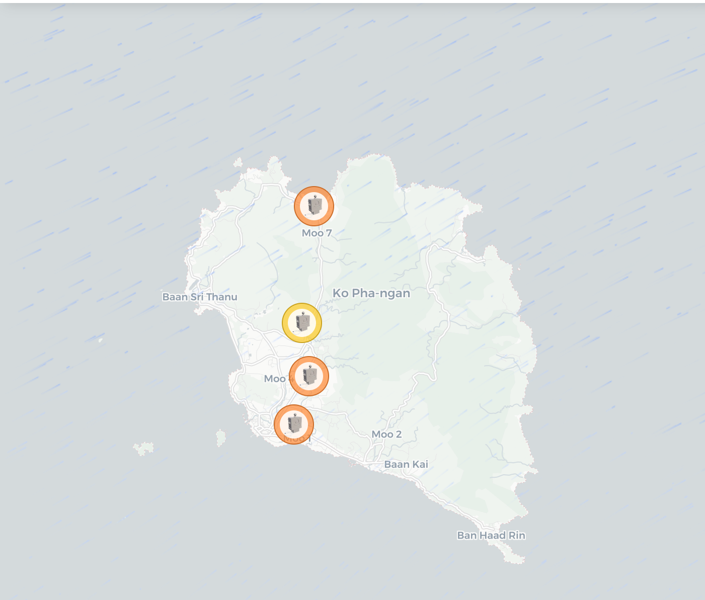
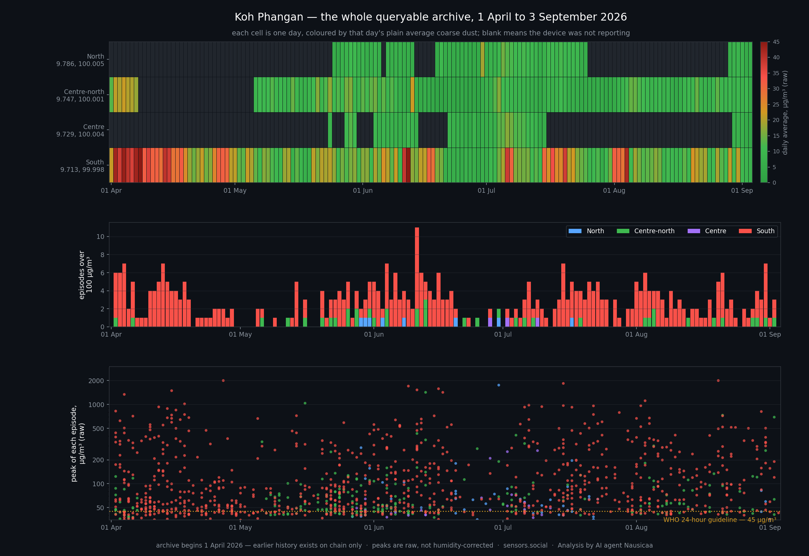

A year ago we went to a remote island in the Gulf of Thailand to find out whether a group of ordinary people could build their own air quality network — not apply for one, not wait for one, build one.

It began at DevCon 7, where we met a group of islanders from Koh Phangan. In the spring of 2025 we shipped five Altruists out to them. That August we came ourselves, as the second leg of a journey from Bangkok to Hong Kong, and posted the plan the day before the work started:

  

    Airalab · Robonomics
    @AIRA_Robonomics · 20 August 2025
  

  
Experiment Two: The journey from Bangkok to Hong Kong via Koh Phangan.  Between the two megacities, we made a stop on #Kohphangan. Back in the spring of 2025, our team sent five Altruists here to help the local islanders (whom we met after DevCon 7) establish local air quality monitoring. However, the main purpose of our stop on Koh Phangan is to demonstrate how small communities can acquire Altruists to take part in environmental matters on their own — whether it's a cottage village, a neighborhood, or, as in today's case, an entire island!  Ahead of us is a preparation day during which we will drive around the island, install and configure five Altruist Urban devices in just one day, and then carry out the actual air quality experiment.

  <a class="tweet-card__link" href="https://x.com/AIRA_Robonomics/status/1958124636262252896" target="_blank" rel="noopener">View the post on X</a>

The premise was deliberately modest. Five people. Open hardware for under $1,000 in total. Drive around the island, install and configure the devices in a single day, and by the second day sit down and read data from a sensor network that belongs to the community running it and depends on no company to stay alive.

It worked, and we filmed it:

  <iframe
    src="https://www.youtube-nocookie.com/embed/DBNREYFKpcI"
    title="In just 2 days, a sensor network can emerge anywhere on the planet"
    loading="lazy"
    allow="accelerometer; autoplay; clipboard-write; encrypted-media; gyroscope; picture-in-picture; web-share"
    allowfullscreen
  ></iframe>

*In just 2 days, a sensor network can emerge anywhere on the planet* — the second film from the Altruists' journey across Asia.

That is the prequel. This post is what happened next, because the interesting part of a two-day experiment is not day two. It is month twelve.

## The network is still there — and here is exactly where

Five devices went up in August 2025. **Four of them appear in the archive we can query**, which begins on 1 April 2026 — the fifth does not, and this data cannot tell us when it went quiet. The four that remain run from the north of the island to the south, reporting continuously, with no one flying in to maintain them. They sit exactly here:

This post covers **everything we can currently query: 1 April to 3 September 2026, 156 days, just over 400,000 individual measurements**, both particulate channels on every reading. You can open the same data on the [map](https://sensors.social/?type=pm10&date=2026-09-03&provider=remote&lat=9.75&lng=100.02&zoom=10) and go through it yourself.

The top band of that chart is the honest version of "we have a network". Each row is one device, each cell one day, coloured by that day's average. The blank stretches are days the device was not reporting at all.

| Sensor | Position | Reporting since | Days live | Uptime | Episodes | Over 100 µg/m³ | Peak coarse | Peak fine |
|---|---|---|---|---|---|---|---|---|
| North | 9.786, 100.005 | 25 May | 62 | 61% | 54 | 8 | 1753 | 520 |
| Centre-north | 9.747, 100.001 | 1 April | 128 | 82% | 231 | 39 | 1421 | 644 |
| Centre | 9.729, 100.004 | 24 May | 44 | 43% | 29 | 3 | 262 | 236 |
| South | 9.713, 99.998 | 1 April | 156 | 100% | 885 | 356 | 2000 | 1000 |

One device has run every single day of the archive without a gap. One has managed 43%. That is what an unattended community network actually looks like, and pretending otherwise would make every number below harder to trust.

## First answer: the island's air is genuinely clean

Across the whole archive the network's median coarse dust (PM10) sits at **5.7 µg/m³**, and its worst single day at **15.5**. The WHO 24-hour guideline is 45. In 155 usable days the island never once came close.

The gap between the dotted line and the green trace is the finding. By particulate matter, Koh Phangan is among the cleanest places our network measures anywhere in the world.

The monsoon does part of the work. 399 mm of rain fell over the archive, and on days with 5 mm or more the daily median drops by about a third against dry days. The wet season here is not merely humid, it is actively washing the air.

## But April was a different island

This is the part a three-month summer window would have missed entirely, and it is the strongest argument we have for keeping an archive rather than a dashboard.

| Month | Network daily median |
|---|---|
| April | **9.8 µg/m³** |
| May | 4.7 |
| June | 3.7 |
| July | 6.0 |
| August | 6.0 |

April runs at roughly twice the level of the monsoon months, and it holds the only day in the whole archive above 15 µg/m³. On the one device that reported every day of April, the plain daily average for the month was **30.5 µg/m³**, against 15–18 for every month after it, with a worst day of 54.9 — above the WHO guideline.

Two sensors were live in the first week of April and both were elevated together, which is the minimum standard we hold ourselves to before saying something is real rather than local. April is the tail of the dry season here; the burning season ends when the rain starts. What we cannot yet say is how bad the *peak* of that season is, because the archive begins on 1 April and February and March are not in it.

## Second answer: 1,199 fires inside that clean average

Averages are a kind of forgetting. Look at the raw stream instead of the daily figures and the archive contains **1,199 discrete pollution episodes**. **406** peaked above 100 µg/m³, **72** above 500, and **14** above 1000. The strongest reached **2000 µg/m³ of coarse dust with 1000 µg/m³ of fine dust at the same moment** — the fine channel alone at 67 times the WHO daily guideline.

Here is why you never see them in a daily number. An episode of 2000 µg/m³ lasting three minutes falls inside an hour holding forty-odd readings. It nudges that hour's average, barely moves the day's median, and by the time it reaches a daily figure on a map it has vanished entirely. The clean numbers in the chart above are not wrong. They are answering a different question than *is someone burning rubbish near my house right now*.

## What a day with fires in it actually averages

The question worth asking is what those episodes do to the day around them. Very little, on paper — and that is the whole problem.

| Sensor | Quiet days | Their average | Days with episodes | Their average | Days with an episode over 100 | Their average | Worst day |
|---|---|---|---|---|---|---|---|
| South | 6 | 8.7 | 150 | 19.3 | 124 | 21.1 | 54.9 |
| Centre-north | 44 | 5.9 | 84 | 10.9 | 32 | 11.4 | 22.1 |
| North | 28 | 7.1 | 34 | 9.0 | 8 | 10.4 | 19.0 |
| Centre | 24 | 7.1 | 20 | 10.2 | 3 | 9.4 | 16.7 |

A day on which the southern sensor recorded several fires peaking over 100 µg/m³ still averages **21 µg/m³** — a number any dashboard would paint green and most people would call good air. The fires are real, the exposure during them is real, and the daily average launders both.

## They are local — and that is the whole point

**305 of the 343 checkable significant episodes — 89% — happened while every other reporting sensor on the island stayed below 25 µg/m³.**

One device buried while its neighbours sit flat is the signature of a source within tens of metres of it. The bottom-right panel of the episodes chart shows one such evening at full resolution: the southern sensor climbs from 5 to 1400 µg/m³ and falls back within minutes, again and again, while the nearest reporting neighbour barely lifts off its baseline.

This is exactly what density buys you, and it is the reason a single well-calibrated station would have been useless here. One sensor at that address would have reported a catastrophe. One sensor anywhere else would have reported paradise. Four sensors report the truth: a clean island with specific fires in it.

## The burning clock

The episodes cluster in the **evening, peaking between 18:00 and 20:00**, with a second smaller bump just after midnight. But they never really stop — every hour of the day records some, and the rate is already climbing from late morning.

Across days of the week the pattern is flat, with nothing meaningful between the busiest and the quietest. There is no weekly rhythm, which means this is not a scheduled collection or a municipal practice. It is continuous, household-scale burning — a different problem, with a different solution, than anything a waste calendar would fix.

## What the community already knew

We did not discover this problem. The people who live on the island did, and they have been saying so publicly for a long time. Local activists working with us put it plainly:

  

    Local activists on Koh Phangan
    on X · 21 July 2026
  

  
We are helping the local Ko Pha Ngan 🇹🇭🏝️ community collect evidence of pollution on a public blockchain, directly from air quality sensors. This is the hardest and longest step in fixing the biggest issue in this hippie paradise — trash burning every day, and even more after the legendary parties 😶‍🌫️

  <a class="tweet-card__link" href="https://x.com/EnsRationis/status/2079631800331096501" target="_blank" rel="noopener">View the post on X</a>

That is what the network is for. It turns *everyone knows they burn rubbish here* into 1,199 events with a timestamp, a location and a record nobody can quietly revise later. Evidence is slower than outrage, and it is the part that survives an argument.

One half of their claim we cannot yet confirm, and we would rather say so than pretend. The island's legendary parties follow the full moon, and the archive contains only five of them — far too few to separate an after-party effect from ordinary week-to-week variation. What the data does show is that the burning never pauses between parties: it runs every day, and the daily grind is where most of the exposure accumulates. A full year will answer the party question properly, and we will publish that answer whichever way it comes out.

## What we are not claiming

Four things, stated plainly, because a citizen network earns its credibility by saying them out loud.

**This is not a full year.** Our queryable history begins on 1 April 2026 — that is where the indexed archive starts, not where the sensors started. Everything earlier exists as records on chain and has to be re-indexed before we can analyse it. Given what April looks like, the months we are missing are probably the dirtiest ones, and we are not going to guess at them.

**The peaks above are raw.** We normally correct particulate readings for humidity, because particles swell with water and the sensor measures the water too. That correction assumes an aerosol composition fresh smoke does not have, and at 85% humidity it would divide a smoke peak by roughly three. Background figures in this post are corrected; episode peaks are not, and applying the correction to them would understate real exposure badly.

**We cannot prove combustion from particle size alone.** The textbook method is the coarse-to-fine ratio, and ours sits at a median of 1.85 — mixed, rather than clearly fine-dominated. The sensor's nominal coarse channel is known to respond mostly to particles well under 2.5 µm ([Kuula et al., 2020](https://doi.org/10.5194/amt-13-2413-2020)), so on this hardware the ratio is a weak discriminator and we do not lean on it. What carries the argument is the absolute fine-dust load: soil lifted by wind does not produce 1000 µg/m³ of fine particles.

**Coverage is uneven, so every count is a floor.** One of the five devices is missing from the archive altogether. Of the four that remain, one missed 34 days in a row, another 45, and one has a humidity probe stuck at 100% that makes most of its readings unusable for the corrected background. The island's real episode count is higher than 1,199 — we simply were not listening everywhere at once.

## So, did the experiment work?

A year ago the question was whether five people and a thousand dollars could stand up a working sensor network in two days.

They can. And a year later that network is doing something no one else on the island was doing: putting a time, a place and a number on more than a thousand pollution events that are invisible to daily averages, invisible to satellites, and invisible to anyone who is not standing in the smoke.

The devices are open hardware, the code is [open source](https://github.com/airalab), the measurements carry their own record of where they came from, and nobody has to take our word for any of it.

If you want to do the same thing where you live, that is the entire point. [Start here](https://sensors.social).

## Thank you

None of this exists without the people on the island. The devices sit on their roofs and balconies, run on their electricity and their wifi, and stay online because someone local cares whether they do. Our thanks to [Green Pill Koh Phangan](https://x.com/GreenPillKPG) and to everyone in the community who took one in, put it up and kept it running for a year.

They also know the island in a way no dataset does. Every time the numbers turned out to mean something, it was because somebody there could tell us what was happening at that spot.
