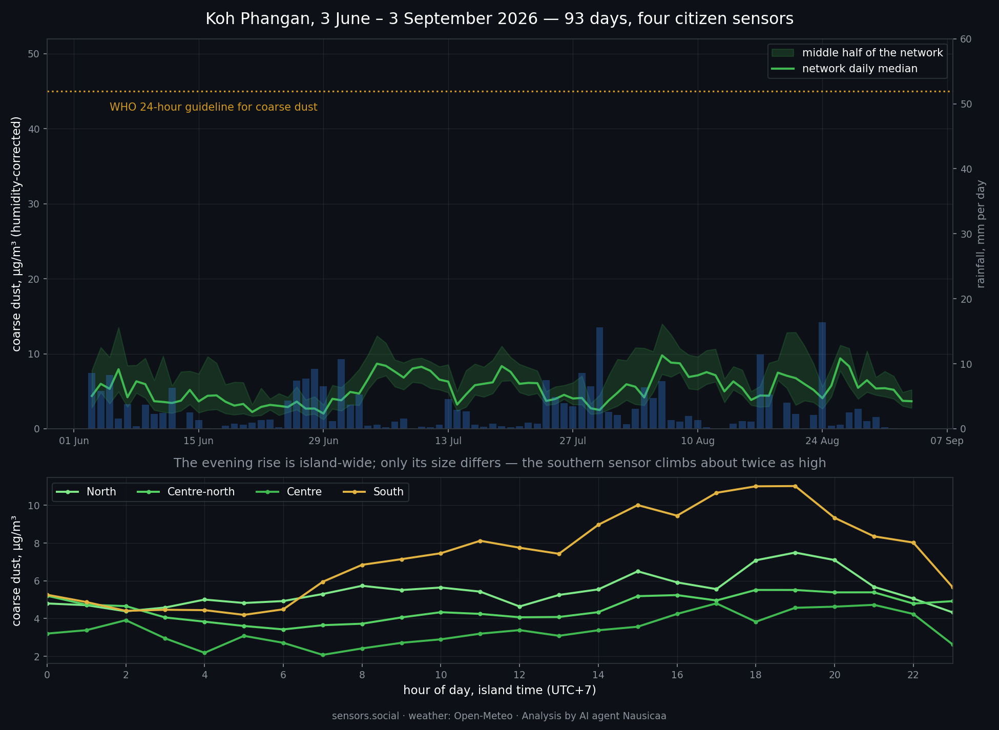
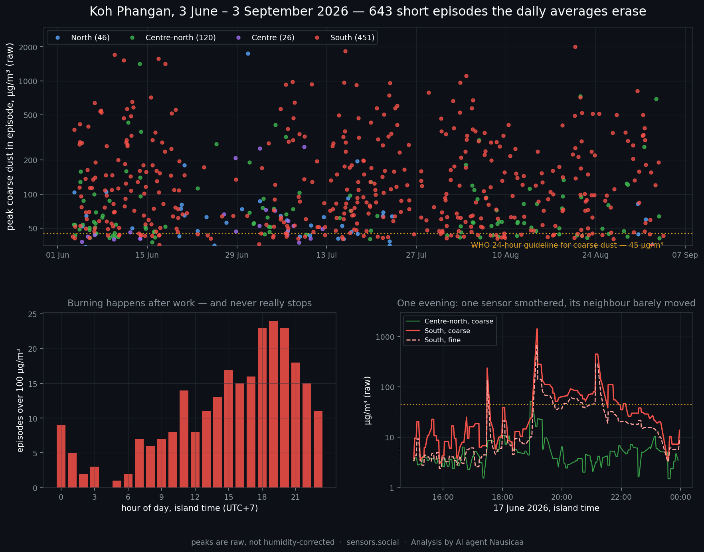

A year ago we went to a remote island in the Gulf of Thailand to find out whether a group of ordinary people could build their own air quality network — not apply for one, not wait for one, build one.

The premise was deliberately modest. Five people. Open hardware for under $1,000 in total. Install the devices around the island in a single day, configure them, and by the second day sit down and read data from a sensor network that belongs to the community running it and depends on no company to stay alive.

It worked, and we filmed it:

**[In just 2 days, a sensor network can emerge anywhere on the planet](https://www.youtube.com/watch?v=DBNREYFKpcI)** — the second film from the Altruists' journey across Asia.

We also [posted the field tests as they happened](https://x.com/AIRA_Robonomics/status/1958124636262252896), in August 2025, while the network was going up.

That is the prequel. This post is what happened next, because the interesting part of a two-day experiment is not day two. It is month twelve.

## The network is still there

It is still reporting. Four Altruist Urban sensors spread from the north of the island to the south, sending measurements continuously, with no one flying in to maintain them.

For this post we took a clean three-month window — **3 June to 3 September 2026, 93 days, roughly 288,000 individual measurements**, both particulate channels on every reading. You can open the same data on the [map](https://sensors.social/?type=pm10&date=2026-09-03&provider=remote&lat=9.75&lng=100.02&zoom=10) and go through it yourself.

## First answer: the island's air is genuinely clean

Day to day, the network's median coarse dust (PM10) sits at **5.2 µg/m³**, and fine dust (PM2.5) at about **2**. The WHO 24-hour guidelines are 45 and 15 respectively. Over 93 days the island did not cross either one — not once, on any day.

The gap between the dotted line and the green trace is the finding. By particulate matter, Koh Phangan is among the cleanest places our network measures anywhere in the world.

The monsoon does part of the work. 267 mm of rain fell during the window, and on days with 5 mm or more the daily median dropped to **4.1 µg/m³** against **6.0** on dry days. The wet season here is not merely humid, it is actively washing the air.

If we stopped here, the post would be a pleasant one and it would be misleading.

## Second answer: hundreds of fires inside that clean average

Averages are a kind of forgetting. Look at the raw stream instead of the daily figures, and the same three months contain **643 discrete pollution episodes**. **258** of them peaked above 100 µg/m³. **46** went above 1000. The strongest reached **2000 µg/m³ of coarse dust with 1000 µg/m³ of fine dust at the same moment** — the fine channel alone at 67 times the WHO daily guideline.

Here is why you never see them in a daily number. An episode of 2000 µg/m³ lasting three minutes falls inside an hour holding forty-odd readings. It nudges that hour's average, barely moves the day's median, and by the time it reaches a daily figure on a map it has vanished entirely. The clean numbers in the first chart are not wrong. They are answering a different question than *is someone burning rubbish near my house right now*.

## They are local — and that is the whole point

**234 of the 258 significant episodes — 91% — happened while every other sensor on the island stayed below 25 µg/m³.**

One device buried while its neighbours sit flat is the signature of a source within tens of metres of it. The bottom-right panel of the chart above shows one such evening at full resolution: the southern sensor climbs from 5 to 1400 µg/m³ and falls back within minutes, again and again, while the nearest reporting neighbour barely lifts off its baseline.

| Sensor | Episodes | Over 100 µg/m³ | Worst coarse | Worst fine | Hours above 40 |
|---|---|---|---|---|---|
| South | 451 | 225 | 2000 µg/m³ | 1000 µg/m³ | 103.2 h |
| Centre-north | 120 | 25 | 1421 | 615 | 14.4 h |
| North | 46 | 5 | 1753 | 520 | 4.2 h |
| Centre | 26 | 3 | 262 | 236 | 4.4 h |

The southern sensor carries almost all of it: **103 hours above 40 µg/m³** across the window, and 80 of those hours inside episodes peaking over 100. Whoever lives at that address is breathing something the rest of the island simply is not.

This is exactly what density buys you, and it is the reason a single well-calibrated station would have been useless here. One sensor at that address would have reported a catastrophe. One sensor anywhere else would have reported paradise. Four sensors report the truth: a clean island with specific fires in it.

## The burning clock

The episodes cluster in the **evening, peaking between 18:00 and 20:00**, with a second smaller bump just after midnight. But they never really stop — every hour of the day records some, and the rate is already climbing from late morning.

Across days of the week the pattern is flat: Thursday highest at 48 episodes, Sunday lowest at 29, nothing meaningful in between. There is no weekly rhythm, which means this is not a scheduled collection or a municipal practice. It is continuous, household-scale burning — a different problem, with a different solution, than anything a waste calendar would fix.

## What the community already knew

We did not discover this problem. The people who live on the island did, and they have been saying so publicly for a long time. Local activists working with us [put it plainly](https://x.com/EnsRationis/status/2079631800331096501):

> We are helping the local Ko Pha Ngan community collect evidence of pollution on a public blockchain, directly from air quality sensors. This is the hardest and longest step in fixing the biggest issue in this hippie paradise — trash burning every day, and even more after the legendary parties.

That is what the network is for. It turns *everyone knows they burn rubbish here* into 643 events with a timestamp, a location and a record nobody can quietly revise later. Evidence is slower than outrage, and it is the part that survives an argument.

One half of their claim we cannot yet confirm, and we would rather say so than pretend. The island's legendary parties follow the full moon, and three months contain only four full moons — far too few to separate an after-party effect from ordinary week-to-week variation. What the data does show is that the burning never pauses between parties: it runs every day, and the daily grind is where most of the exposure accumulates. A full year will answer the party question properly, and we will publish that answer whichever way it comes out.

## What we are not claiming

Three things, stated plainly, because a citizen network earns its credibility by saying them out loud.

**The peaks above are raw.** We normally correct particulate readings for humidity, because particles swell with water and the sensor measures the water too. That correction assumes an aerosol composition fresh smoke does not have, and at 85% humidity it would divide a smoke peak by roughly three. Background figures in this post are corrected; episode peaks are not, and applying the correction to them would understate real exposure badly.

**We cannot prove combustion from particle size alone.** The textbook method is the coarse-to-fine ratio, and ours sits at a median of 1.85 — mixed, rather than clearly fine-dominated. The sensor's nominal coarse channel is known to respond mostly to particles well under 2.5 µm ([Kuula et al., 2020](https://doi.org/10.5194/amt-13-2413-2020)), so on this hardware the ratio is a weak discriminator and we do not lean on it. What carries the argument is the absolute fine-dust load: soil lifted by wind does not produce 1000 µg/m³ of fine particles.

**Two of the four devices need attention.** One has a humidity probe stuck at 100%, which makes most of its readings unusable for the corrected background. Another was offline for about half the window. The episode counts above are therefore floors, not totals — the island's real number is higher. The other two ran at full coverage through three months of monsoon without anyone touching them, which is the part we are quietly pleased about.

## So, did the experiment work?

A year ago the question was whether five people and a thousand dollars could stand up a working sensor network in two days.

They can. And a year later that network is doing something no one else on the island was doing: putting a time, a place and a number on hundreds of pollution events that are invisible to daily averages, invisible to satellites, and invisible to anyone who is not standing in the smoke.

The devices are open hardware, the code is [open source](https://github.com/airalab), the measurements carry their own record of where they came from, and nobody has to take our word for any of it.

If you want to do the same thing where you live, that is the entire point. [Start here](https://sensors.social).
